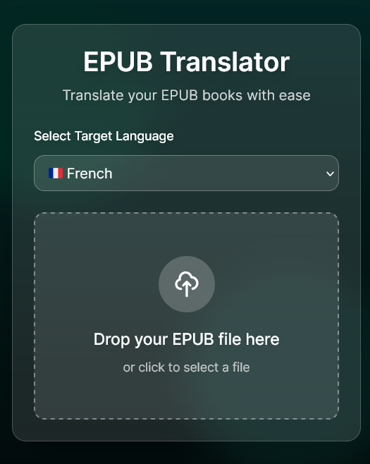

# EPUB Translator

A modern web application that translates EPUB books while preserving their formatting. Built with Next.js 14, TypeScript, and Tailwind CSS.

🌐 **[Try it live](<a href="https://epub-translator-yc1l-ddh3.onrender.com/" target="_blank">epub-translator-yc1l-ddh3.onrender.com/</a>)**



## Features

- 🌍 Translate EPUB books to 95+ languages
- 🎨 Preserves original EPUB formatting and structure
- 💨 Fast translation with concurrent processing
- 🔄 Real-time translation progress tracking
- 📱 Responsive design with modern UI
- 🎯 Drag and drop file upload
- 🔒 Client-side processing for privacy

## Tech Stack

- **Framework**: [Next.js 14](https://nextjs.org/) with App Router
- **Language**: [TypeScript](https://www.typescriptlang.org/)
- **Styling**: [Tailwind CSS](https://tailwindcss.com/)
- **Translation**: DeepSeek API
- **EPUB Processing**: JSZip
- **Deployment**: Render

## Getting Started

### Prerequisites

- Node.js (v20.9.0 or higher)
- yarn
- DeepSeek API key

### Installation

1. Clone the repository:
```bash
git clone https://github.com/yourusername/epub-translator.git
cd epub-translator
```

2. Install dependencies:
```bash
yarn
```

3. Create a `.env.local` file in the root directory and add your DeepSeek API key:
```env
NEXT_PUBLIC_DEEPSEEK_API_KEY=your_api_key_here
```

4. Run the development server:
```bash
yarn dev
```

5. Open [http://localhost:3000](http://localhost:3000) in your browser.

## Project Structure

```
epub-translator/
├── src/
│   ├── app/                # Next.js app router files
│   ├── components/         # React components
│   │   ├── EpubUploader.tsx
│   │   ├── LanguageSelector.tsx
│   │   ├── UploadArea.tsx
│   │   ├── TranslationProgress.tsx
│   │   ├── SuccessMessage.tsx
│   │   └── CancelModal.tsx
│   ├── hooks/             # Custom React hooks
│   ├── services/          # External services integration
│   ├── types/             # TypeScript type definitions
│   └── utils/             # Utility functions
├── public/                # Static files
├── tailwind.config.js     # Tailwind CSS configuration
└── next.config.js         # Next.js configuration
```

## Development

- Run development server: `yarn dev`
- Build for production: `yarn build`
- Start production server: `yarn start`
- Lint code: `yarn lint`


## License

This project is licensed under the MIT License - see the LICENSE file for details.

## Acknowledgments

- [Next.js](https://nextjs.org/) for the amazing React framework
- [Tailwind CSS](https://tailwindcss.com/) for the utility-first CSS framework
- [DeepSeek](https://deepseek.com/) for the translation API
- [JSZip](https://stuk.github.io/jszip/) for EPUB processing
- [Render](https://render.com/) for deployment
